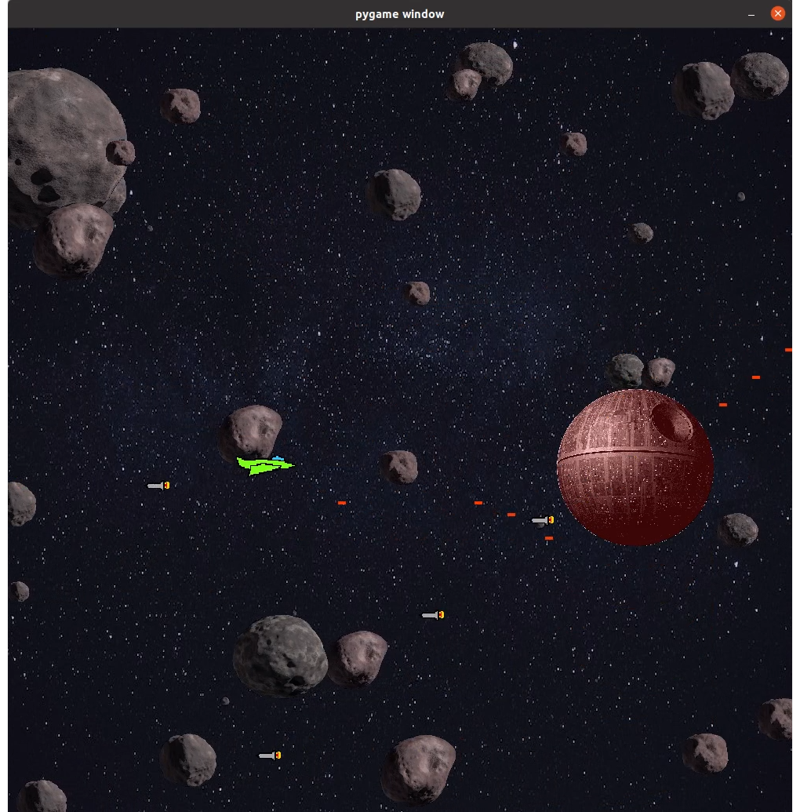

# Welcome to pywars!

Pywars is my first video game and my first significant software development.
It is a "Shoot them up" game inspired from the tutorial https://realpython.com/pygame-a-primer/#images-and-rects .




# Install & run
Pywars was developed with Python3.8. The only requirement is the module **pygame**:
```
pip install pygame
```
Then to run it just launch the file **menu.py**:
```
python menu.py
```

# Exe for Windows
Here is [a link to an exe that runs on Windows](https://www.dropbox.com/scl/fi/9j4zhlma5f7yb0pdhpzig/pywars.exe?rlkey=6asxu3n71aqou0ufkqjewm2mm&st=edb1xms7&dl=0)
(close the pop-up, click on "Download" and double click on the downloaded file)

# Gameplay
Simply use the arrow keys to move and the space key to fire lasers

# Project structure
* sprites.py: contains classes defining the different types of objects (sprites) used in the game: player, enemy, background objects, decors, final boss
* play.py: contains the game logic itself
* main.py: creates a first menu page before entering the game
* config.json: the settings of the game
* images: picture files
* sounds: sound files

# Configuration
A lot of parameters are defined in the configuration file. Here are some of them:
* size of screen
* whether we activate sounds
* frames per seconds
* colors
* speeds of the objects
* frequencies of apparition
* background objects
* definition of the tunnel
* images' paths and characteristics
* sounds' paths and characteristics
* number of hits to kill the boss
* and many others...
